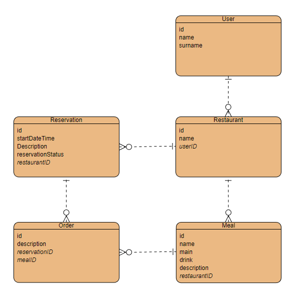

# Restaurant Application

This is a restaurant management system where a user is able to create restaurants, manage reservations and manage orders for each reservation

## Features

- Admin control over all reataurants, reservations and orders created by standard users
- Ability to create set meals to be used when making orders
- A nice visual representation in the tables showing number of reservations, orders and meals for each restaurant 
- JWT authentication

# Preview
### Manage Restaurants
A user can manage the list of restuarants as well as view the amount of set meals and reservations for each. 
Clicking the numbers on the table under 'Meals' or 'Reservations' will redirect the user to the respective manage pages where they can either add / update meals or reservations.
To Add a new restaurant, a user must click the 'Add restaurant button above the table'

### Manage Reservations
A user can manage the list of reservations as well as view the amount of orders created for each reservation
Clicking the numbers on the table under 'Number of orders' will redirect the user to the respective manage page where they can either add / update orders
Initially the 'Add reservation' button above the table is disabled. A user needs to first select a restaurant before they can add a reservation
// IMage goes herer

### Manage Meals
A user can manage the list of meals for each restaurant
Initially the 'Add Meal' button above the table is disabled. A user needs to first select a restaurant before they can add a meal.
All the food types are hard coded into the application.
// IMage goes herer

### Manage Users
The admin can create / udpated users for the system
// IMage goes herer

## Tech Used

The application was built with dotnetcore 6 for the backend, ReactJS for the front end and SQL lite for the databse

- [ASP.NET 6](https://docs.microsoft.com/en-us/aspnet/core/introduction-to-aspnet-core?view=aspnetcore-6.0)
- [ReactJS](https://reactjs.org/)
- [SQLite](https://www.sqlite.org/index.html)

## Database design

//Image here

# How to run the app on your local:

### Startup the backend
- `cd` into the reactnet folder
- `dotnet run`
- The backend is now up and running

### Startup the Front end
- `cd` into the `reactnet/clientApp` folder
- `npm install` to install all the packages needed for the app 
- `npm start` to run the application

